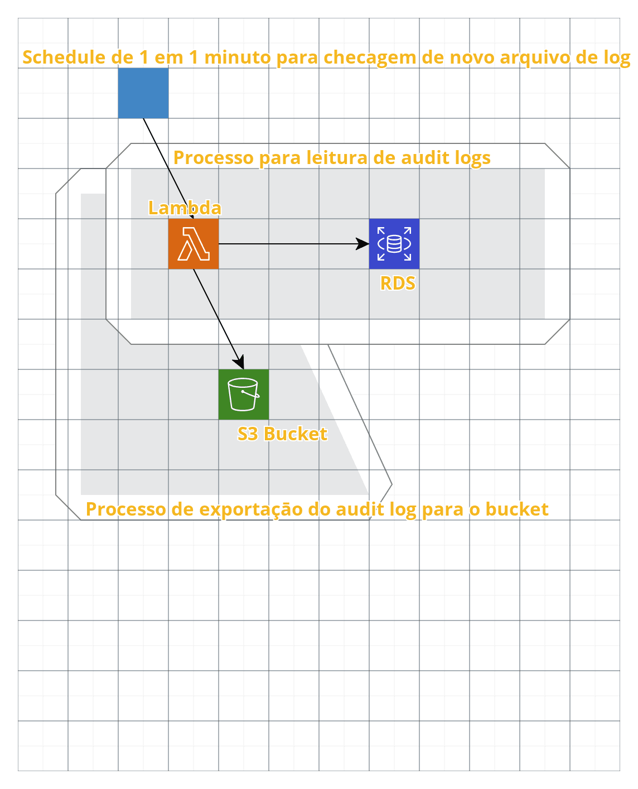

### Pré-requisitos
Todo o script foi feito usando um macOS

|        Tool        |       Versão             |
|--------------------|--------------------------|
|Python              |       3.7.5              |
|Terraform           | Terraform v0.12.25       |
|provider.archive    | v1.3.0                   |
|provider.aws        | v2.63.0                  |
|AWS CLI             | 1.18.66                  |

- [Python](https://www.python.org/downloads/)
- [Terraform](https://www.terraform.io/downloads.html)
- [Conta na AWS](https://console.aws.amazon.com/)
---
- [AWS CLI](https://docs.aws.amazon.com/cli/latest/userguide/install-macos.html)

Passos pós instalaçāo do AWS CLI, obs: somente executar em caso de primeira instalaçāo

### Iniciar o AWS CLI

- `aws configure` e  inserir o AWS Access Key ID e AWS Secret Access Key

Feito isso será criado um diretório no root de credentials`~/.aws/credentials`

---

- [Criar usuário ADM no IAM (marcar a opçāo "Programmatic access")](https://console.aws.amazon.com/iam/home#/users$new?step=details)
- Setar permissões abaixo:

Policy Name|
| -------------             |
|AdministratorAccess        |
---

### <a name="envs">Variáveis de ambiente</a>

Exportar variáveis abaixo

|                    |                          |
|--------------------|--------------------------|
|aws_profile         | <nome_do_seu_profile>    |
|db_name             | <database_name>          |
|db_user_name        | <db_username>            |
|db_user_password    | <db_user_password>       |
|bucket_name         | <bucket_name>            |

Uma forma simples de exportar as variáveis:

Fazer uma cópia renomeando o arquivo `.env.example` para `.env` e substituir as variáveis, feito isso ao executar qualquer comando make <command> o arquivo de `.env` será carregado automaticamente.

---

### Scripts Makefile
No diretório root da aplicação digite `make` e veja todos scripts possíveis

Os scripts de criação do terraform usarão as variáveis de ambiente para criar o arquivo security.tfvars na pasta [terraform](terraform/aws)

### Passos para execução

* Executados os primeiros passos [aqui](#first)
* Clone este repositório
* Exporte as variáveis conforme passo: [aqui](#envs)
* Execute `make init`
* Feito isso você já consegue executar a criação dos ambientes de `dev`  e `prod`
* Você também consegue forçar a execução do lambda com o comando `make invoke`
* Agora basta checar no bucket os arquivos de `audit`
* A única dependência do projeto `boto3==1.13.16` esta no aquivo de [requirements.txt](lambda_func/requirements.txt)
* Para instalar basta executar pip install -r requirements.txt na pasta [lambda_func](lambda_func)

### Arquitetura

